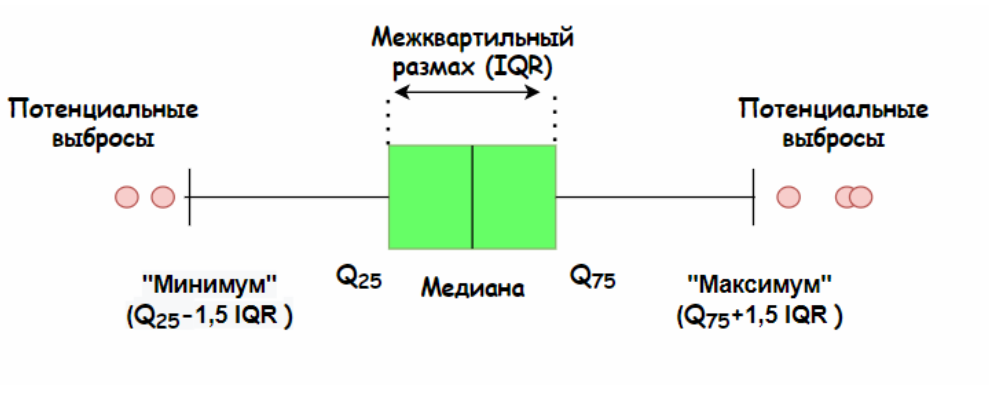

# Статистические методы поиска выбросов и очистки от неинформативных столбцов таблицы

## Понятие выброса
Одним из этапов очистки данных является поиск выбросов.

***Выброс (аномалия)*** - это наблюдение, которое существенно выбивается из общего распределения и сильно отличается от других данных.

В данном разделе рассматриваются статистические методы поиска выбросов, а именно:
* Метод межквартиального размаха 
* Метод z-отклонений (метод сигм)

А также метод очистки неинформативных столбцов

## Метод межквартильного размаха



### Алгоритм метода:

1. Вычислить 25-ую и 75-ую квантили (1 и 3 квартили) - $Q_{25}$ и $Q_{75}$ для признака, который мы исследуем
2. Вычислить межквартильное расстояние:  
    * $IQR=Q_{75}-Q_{25}$
3. Определить верхнюю и нижнюю границы Тьюки: 

    * $bound_{upper} = Q_{75} + 1.5*IQR$
    
    * $bound_{lower} = Q_{25} - 1.5*IQR$
4. Найти наблюдения, которые выходят за пределы границ


### **Недостатки метода:**

Метод требует, чтобы признак, на основе которого происходит поиск выбросов, был распределен нормально.

### **Модификация метода:**

Можно попробовать воспользоваться методами преобразования данных, например, логарифмированием, чтобы попытаться свести распределение к нормальному или хотя бы к симметричному. 

Также можно добавить вариативности количеству квартильных размахов в левую и правую сторону распределений.


## Метод z-отклонений (метод сигм)

Правило трех сигм гласит: что, если распределение данных является нормальным, то 99.73% лежат в интервале: $(\mu-3 \sigma$ , $\mu+3 \sigma)$, 
где  
* $\mu$ - математическое ожидание (для выборки это среднее значение)
* $\sigma$ - стандартное отклонение. 

Наблюдения, которые лежат за пределами этого интервала будут считаться выбросами.


### **Алгоритм метода:**

1. Вычислить среднее и стандартное отклонение $\mu$ и $\sigma$ для признака, который мы исследуем
2. Определить верхнюю и нижнюю границы:
    * $bound_{upper} = \mu - 3 * \sigma$
    
    * $bound_{lower} = \mu + 3 * \sigma$
3. Найти наблюдения, которые выходят за пределы границ

### **Недостатки метода:**
Метод требует, чтобы признак, на основе которого происходит поиск выбросов, был распределен нормально.

### **Модификация метода:**

Можно попробовать воспользоваться методами преобразования данных, например, логарифмированием, чтобы попытаться свести распределение к нормальному или хотя бы к симметричному. 

Также можно добавить вариативности количеству стандартных отклонений в левую и правую сторону распределений.

Кроме этого можно выставить автоматический поиск центра симетрии нормального распределения

## Реализация методов

Методы реализованы в виде функций find_outliers_iqr() и find_outliers_z_score(). Функции представлены в файле find_outliers.py. К функциям предоставлена документация.

## Пример использования

Обязательными аргументами функций, реализующих методы поиска выбросов являются:
* data (pandas.DataFrame): набор данных (таблица)
* feature (str): имя признака, на основе которого происходит поиск выбросов

Использование классических подходов без модификаций:
```python
# Метод межквартильного размаха
from outliers_lib.find_outliers import find_outliers_iqr

outliers_iqr, cleaned_iqr = find_outliers_iqr(data, feature)

# Метод z-отклонений
from outliers_lib.find_outliers import find_outliers_z_score

outliers_z_score, cleaned_z_score = find_outliers_z_score(data, feature)
```
Использование методов с предварительным логарифмированием:
```python
outliers_iqr, cleaned_iqr = find_outliers_iqr(data, feature, log=True)
outliers_z_score, cleaned_z_score = find_outliers_z_score(data, feature, log=True)
```
Использование методов с предварительным логарифмированием и добавлением вариативности разброса:
```python
outliers_iqr, cleaned_iqr = find_outliers_iqr(data, feature, log=True, left=2, right=2)
outliers_z_score, cleaned_z_score = find_outliers_z_score(data, feature, log=True, left=2, right=2)
```
Использование метода find_outliers_z_score с автоматическим поиском симетрии нормального распределения:
```python
outliers_z_score, cleaned_z_score = find_outliers_z_score(data, feature, auto=True)
```

## Поиск неинформативных столбцов

**Неинформативный столбец** - это столбец с признаками, который не несет полезной информации в данных, а лишь увеличивает объем памяти и время обработки таблицы во время анализа и построения моделей.

При поиске неинформативных столбцов опираются на следующие правила:
1. Столбец подлежит удалению если 90 - 95% его данных повторяются
2. Столбец подлежит удалению если 90 - 95% его данных уникальны

Но вы вольны сами выбирать какие столбцы являются для вас информативными, а какие нет.

### Алгоритм метода:

1. Производим пробег по каждому столбцу таблицы
2. Вычисляем частоту моды столбца *top_freq*
3. Вычисляем процент уникальных значений относительно общего числа значений *nunique_ratio*
4. Добавляем имя столбца в результирующий список, если один из показателей превышает 95%

### Недостатки метода:

Метод не знает какой из столбцов является действительно важным для анализа, то есть какой-то числовой признак, который кажется важным будет выявлен как неинформативный из-за кол-ва уникальных значений

### Модификация метода:

Можно изменить порог вхождения, изменяя процент (с 95% к примеру до 80% или 20%)

Также можно передать имя столбца или список столбцов, которые стоит игнорировать при поиске

### Реализация метода

Метод реализован в виде функций find_low_inf_columns(). Функция представлена в файле find_outliers.py. К функции предоставлена документация.

### Пример использования

Обязательным аргументом функции является:
* data (pandas.DataFrame): набор данных (таблица)

Использование классического подхода без модификаций:
```python
from outliers_lib.find_outliers import find_low_inf_columns

low_information_cols = find_low_inf_columns(data)
```
Использование метода с изменением порога вхождения:
```python
low_information_cols = find_low_inf_columns(data, ratio=0.7)
```
Использование метода с исключением столбца:
```python
ignore_col = "col_3"
low_information_cols = find_low_inf_columns(data, ignore=ignore_col)
```
Использование метода c изменением порога вхождения и использованием игнорируемых столбцов:
```python
ignore_cols = ["col_1", "col_3", ... , "col_n"]
low_information_cols = find_low_inf_columns(data, ratio=0.36, ignore=ignore_cols)
```

## Использованные инструменты и библиотеки
* numpy (1.20.3)
* pandas (1.3.4)

## Дополнительные источники:
* [Нормальное распределение](https://ru.wikipedia.org/wiki/Нормальное_распределение)
* [Метод межквартильного размаха](https://recture.ru/common/chto-takoe-pravilo-mezhkvartilnogo-razmaha/)
* [Правило трех сигм](https://wiki.loginom.ru/articles/3-sigma-rule.html)